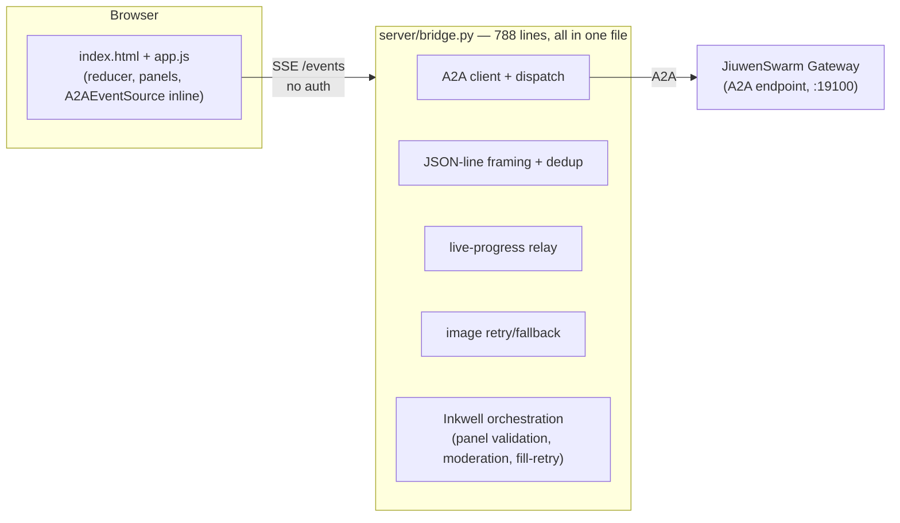
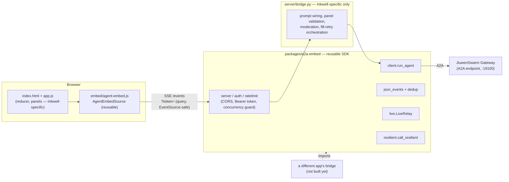

# Inkwell Studio → productized A2A embed path

This documents what actually changed when Inkwell Studio's A2A path was productized: a
reusable Python SDK (`packages/a2a-embed/`) extracted from the demo's own bridge, a
generic SSE transport class pulled out of the front-end, auth + a concurrency guard, and
corrected docs. It's the "before/after" for the plan discussed in this repo's chat history
— see `demos/inkwell-studio/README.md` and `packages/a2a-embed/README.md` for the
per-piece detail; this page is the picture of how they fit together.

## Before

Every piece — A2A transport, JSON-protocol framing, whitespace dedup, live-progress
forwarding, image-retry logic, and all the FastAPI plumbing (CORS, auth, the SSE route
itself) — lived inline in one 788-line `bridge.py`, mixed in with Inkwell's own
storybook-specific orchestration. No auth, no concurrency limit, no CORS. The front-end's
SSE client (`A2AEventSource`) was defined inline in `app.js` too. A second app wanting the
same "browser ↔ bridge ↔ A2A gateway" shape would have had to copy `bridge.py` and pick the
generic parts back out by hand — including rediscovering the same multi-session gotchas
(empty-metadata crash, streaming whitespace, team-mode deadlocks) that had already been
solved once.

## After

The generic pieces moved into `packages/a2a-embed/`, an installable package with its own
`pyproject.toml` (following the `packages/jiuwenswarm-tui` precedent) — transport
(`client.run_agent`), JSON framing (`json_events`), dedup (`dedup`), live-progress relay
(`live.LiveRelay`), a resilient-retry helper (`resilient.call_resilient`), and a FastAPI
app-factory layer (`server`, `auth`, `ratelimit`) with Bearer-token auth (ported from
`jiuwenbox`'s identical pattern — the only prior auth convention in this repo), CORS, and a
concurrency guard. `bridge.py` shrank to what's actually Inkwell's: the guided-protocol
prompt wiring, panel/brief validation, moderation, and the team/single-agent fallback
orchestration. On the front-end, the one genuinely reusable piece —  the SSE client — moved
to `embed/agent-embed.js` as `AgentEmbedSource`; `app.js` imports it instead of defining it
inline. (The other ~900 lines of `app.js` — reducer, panel rendering, narration, exports —
stayed put: they're genuinely Inkwell-specific, and rewriting them into a generic
multi-instance widget was assessed as not worth the regression risk for a second consumer
that doesn't exist yet.)

## What a new app gets for free vs. still has to write

| | Before (copy bridge.py) | After (depend on a2a-embed) |
|---|---|---|
| A2A transport, request metadata handling | Reimplement | `client.run_agent` |
| JSON-line protocol framing, tool-noise robustness | Reimplement | `json_events.parse_events` |
| Whitespace-dedup for streamed text | Rediscover the bug, then fix it | `dedup.best_variants` |
| Live partial-progress forwarding | Reimplement | `live.LiveRelay` (pluggable `live_view`) |
| Retry-then-fallback for a flaky backend call | Reimplement | `resilient.call_resilient` |
| Auth, CORS, concurrency limiting | Usually skipped | `server.add_auth` / `add_cors` / `ConcurrencyGuard` |
| Browser SSE client with reconnect semantics | Reimplement | `embed/agent-embed.js`'s `AgentEmbedSource` |
| **Event vocabulary + guided-protocol prompt** | Still yours | **Still yours** — this is the actual app |
| **UI rendering / reducer** | Still yours | **Still yours** — this is the actual app |

The bottom two rows are the point: productizing this removed the infrastructure tax
(the parts that caused real incidents — a 5.5-hour team-mode hang, a whitespace bug that
took a full session to trace, a docs example that silently failed for a missing header —
see `packages/a2a-embed/README.md` and this repo's `A2A.md §6.3`/`§8`). It does not remove
the work of designing a new app's own protocol and UI — that was always going to be
different per app, and no amount of SDK extraction changes that.

## Fixed along the way (framework, not just extraction)

Verified against current code before doing any of the above (the original "5-step
productization plan" assumed 4 outstanding framework bugs; re-checking found 3 already
fixed upstream since that conversation, 1 already had a proportionate generic mitigation):

- Empty-metadata crash — fixed (`a2a_connect.py`, commit `614fbdd47`).
- Streaming whitespace bug — fixed (`a2a_connect.py`, 2026-07-19).
- Team-mode `mode` metadata routing — fixed (`a2a_connect.py`).
- Team-mode deadlock — generic `max_iterations=200`/`completion_timeout=600s` ceiling now
  exists (`config_loader.py`); Inkwell's lean-brief mitigation stays primary by design (see
  `[[inkwell-studio-a2a-integration]]` — raising the cap was explicitly decided against).
- `docs/en/A2A.md`'s curl examples — were missing the required `A2A-Version: 1.0` header
  (a2a-sdk 1.0 defaults an unversioned request to protocol `"0.3"` and rejects it); traced
  to `a2a.utils.version_validator.validate_version` and fixed with a one-line header addition
  plus a verified Python-client example.
